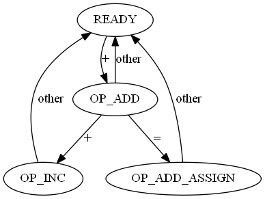

# 词法分析

## 词法分析的定义

这里给词法分析一个不是非常严谨的定义，方便大家理解：

1. 词法分析是编译的第一个主要步骤（预处理等除外）。
2. 词法分析是将源代码解析分割为一个个`token`的过程（`tokenize`）。
3. `token`可以是一个标识符(Identifier)，也可以是一个整数（Integer），也可以是一个运算符（Operator如:`+`）等。
4. 词法分析是语法分析的基础。

## 词法分析的原理

通过以上词法分析的定义，我们可以思考怎样方式来实现词法分析：

1. 词法分析原则是是一种对字符串的模式识别。
2. 模式识别一般可以用正则表达式来表示。
3. 正则表达式可以用有限状态机来实现。
4. 所以词法分析器基本上就是一个有限状态机的实现。

## 词法分析器的设计

词法分析器(Lexcial Analyzer)是实现词法分析的部件，其需要具备以下基本功能：

1. 第一步是源代码的读取，有多种方法，如直接读取文件等，我们这里将其抽象为一个读取器。
2. 逐个字符的读取来驱动词法分析的状态机。
3. 由于有些分析需要提取后面字符才能确定含义，所以读取器需要支持超前搜索。
4. 如果词法解析遇到错误，要有一个词法错误的记录及继续执行的方法，以便程序可以继续，而不是直接抛出异常，直接中断执行，这样的好处是可以尽可能的一次为用户提供更多的错误信息。
5. 关键字是一种特殊的标识符，需要和一般的标识符区分。关键字可能很多，如果只是简单的顺序查找关键字列表可能效率比较低，一种比较好的方法是通过哈希表(`HashTable`)来查找。

## 词法分析器的实现

+ 项目词法分析的相关代码位于`src/compiler`目录下。
+ 词法分析器主要是通过类`LexicalAnalyzer`来实现的，该类本质上是一个有限状态机。
  
## 词法分析器的状态
### 数字字面量的识别状态说明

定义最终状态：
FinalState = ZERO | DEC_INTEGER | FLOAT | HEX_INTEGER | OCT_INTEGER | BIN_INTEGER

最终状态到READY状态的转换规则：
FinalState -> READY{ch = space | \t | \n | operator | seperator}

最终状态到ERROR状态的转换规则：
FinalState -> ERROR{ch = other}

### 字符字面量的识别状态说明

### 字符串字面量的识别状态说明

### 标志符的识别状态说明

### 其他符号的识别状态

### 注释符号的识别状态说明

支持两种注释：
- 单行注释符号：// 开头的至行末尾均为注释
- 多行注释符号：/* 包裹的所有字符均为注释，可跨行 */

